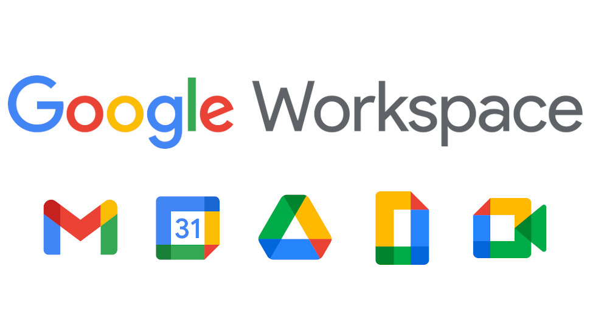

# Google Workspace Administration for Non Profit 
Established a new Google Workspace domain for a non profit in order to modernize communication and collaboration infrastructure.  The organization previosuly had no domain infrastructure which presented inefficiencies, security vulnerabilities, difficulties in collaboration, and resource management.

## Environments and Technologies Used

- Google Workspace

## Operating Systems Used

- Windows 10

## High-Level Deployment and Configuration Steps

- Sign Up for Google Workspace
- Create DNS records to verify domain ownership
- Set Up User Accounts
- Configure Email
- Configure Email Distributions
- Configure Domain Alias
- Enable Additional Services
    - Google Meet for video conferencing 
    - Google Chat for team messaging
- Train Users
- Setup Google Workspace Sync on all client workstations

<h2>Architecture Diagram</h2>

